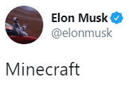

# eloncraft

Who says you can't build a colony on Mars, or dig a tunnel across a city, or ride in fully electric, self-driving cars? Certainly not this mod. By bringing the magic of Elon Musk™ to Minecraft, Eloncraft lets you fulfill your wildest dreams of becoming a hat merchant or sending cars into space. 

Planned features include items from three of Elon Musk's companies: SpaceX, Tesla, and The Boring Company. Currently, development is focused on SpaceX.

Launch trailer:  

If you want to contribute, check out the [contributing guidelines](contributing.md).

## Credits

[@AdityaGupta1](https://github.com/AdityaGupta1) - main developer  
[@qiandasen](http://github.com/qiandasen) - art and textures

## Special Thanks

[@Ellpeck](http://github.com/Ellpeck) - for making [Actually Additions](https://github.com/Ellpeck/ActuallyAdditions) open-source  
[@Choonster](https://github.com/Choonster) - for making [Test Mod 3](https://github.com/Choonster-Minecraft-Mods/TestMod3) open-source
